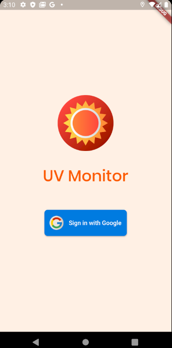
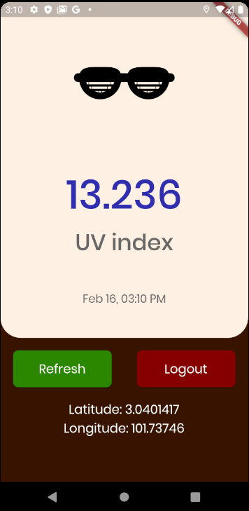

# uv_assessment

Assessment project for Enlightyx.io

## Getting Started

1. This application use [Open UV](https://www.openuv.io/).

2. If the API has error due to token / attempt, generate 
your token in the url and update `main.dart` for value `UV_TOKEN`

3. Google apikey is exposed since this is a public repo and 
no monetary transaction.

4. Works only for Android. I don't think even web could use this due to plugins.

5. `key.jks` is also part of this sourcecode since no signing / security required for this application.

### Prerequisites
1. Flutter
2. Android Studio / XCode - For emulator / simulator
3. IDE - Android Studio, IntellliJ IDEA, VSCode.

### Running
1. `flutter run` on terminal or IDE configuration setup.

## Running the tests
1. `flutter test --coverage` - This will generate [LCOV](http://ltp.sourceforge.net/coverage/lcov.php)

## Formatter
1. Run `dartfmt -w lib/ test/`

## Build with
1. Architecture.
    1. [Flutter_bloc](https://pub.dev/packages/flutter_bloc) - State Management
    2. [Flutter_hooks](https://pub.dev/packages/flutter_hooks) - Widget Lifecycle
    3. [Equatable](https://pub.dev/packages/equatable) - Object management
    4. [Intl](https://pub.dev/packages/intl) - Application Language management
    
    **note**: Internationalization is built with [Flutter_intl_jetbrain](https://plugins.jetbrains.com/plugin/13666-flutter-intl) plugins.
    There's also plugins for [vscode](https://marketplace.visualstudio.com/items?itemName=localizely.flutter-intl)

2. Services
    1. [Dio](https://pub.dev/packages/dio) - Network
    2. [Retrofit](https://pub.dev/packages/retrofit) - Network Interface
    
3. etc:
    1. [Fonts](https://pub.dev/packages/google_fonts)


## Screenshots





## Development environment

```
flutter doctor -v

[✓] Flutter (Channel master, v1.15.4-pre.82, on Linux, locale en_US.UTF-8)
    • Flutter version 1.15.4-pre.82 at /home/yuzuriha/devenv/flutter
    • Framework revision e481fcae52 (25 hours ago), 2020-02-14 22:34:30 -0800
    • Engine revision d60f298d9e
    • Dart version 2.8.0 (build 2.8.0-dev.9.0 edd64e6d5c)

[✓] Android toolchain - develop for Android devices (Android SDK version 29.0.2)
    • Android SDK at /home/yuzuriha/Android/Sdk
    • Android NDK location not configured (optional; useful for native profiling support)
    • Platform android-29, build-tools 29.0.2
    • ANDROID_HOME = /home/yuzuriha/Android/Sdk
    • ANDROID_SDK_ROOT = /home/yuzuriha/Android/Sdk
    • Java binary at: /home/yuzuriha/.local/share/JetBrains/Toolbox/apps/AndroidStudio/ch-0/191.6010548/jre/bin/java
    • Java version OpenJDK Runtime Environment (build 1.8.0_202-release-1483-b49-5587405)
    • All Android licenses accepted.

[✓] Chrome - develop for the web
    • Chrome at google-chrome

[!] Android Studio (version 3.5)
    • Android Studio at /home/yuzuriha/.local/share/JetBrains/Toolbox/apps/AndroidStudio/ch-0/191.6010548
    ✗ Flutter plugin not installed; this adds Flutter specific functionality.
    ✗ Dart plugin not installed; this adds Dart specific functionality.
    • Java version OpenJDK Runtime Environment (build 1.8.0_202-release-1483-b49-5587405)

[✓] IntelliJ IDEA Ultimate Edition (version 2019.3)
    • IntelliJ at /home/yuzuriha/.local/share/JetBrains/Toolbox/apps/IDEA-U/ch-0/193.5662.53
    • Flutter plugin version 43.0.3
    • Dart plugin version 193.5731

[✓] Connected device (3 available)
    • Android SDK built for x86 • emulator-5554 • android-x86    • Android 10 (API 29) (emulator)
    • Chrome                    • chrome        • web-javascript • Google Chrome 80.0.3987.100
    • Web Server                • web-server    • web-javascript • Flutter Tools
```

## Authors

* [**Yusuf Rosman**](https://github.com/zaralockheart)

## License

This project is licensed under the MIT License - see the [LICENSE.md](LICENSE.md) file for details

## Acknowledgments

* Special thanks to:
1. [/r/FlutterDev](https://discordapp.com/invite/N7Yshp4)
2. [Felix](https://twitter.com/felangelov?lang=en) - maintainer of flutter_bloc
3. Libraries Author.

